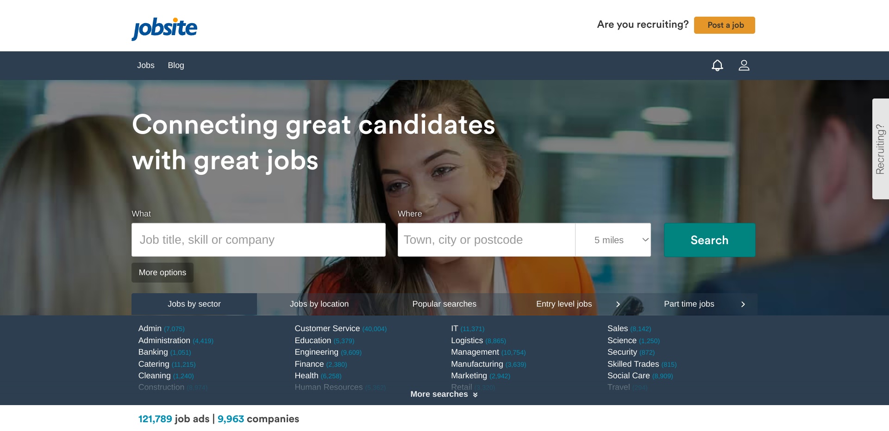
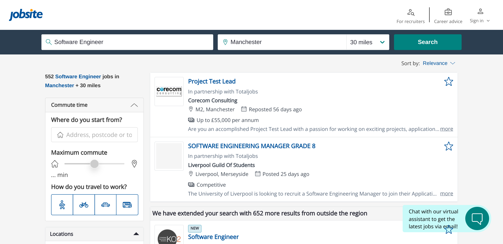
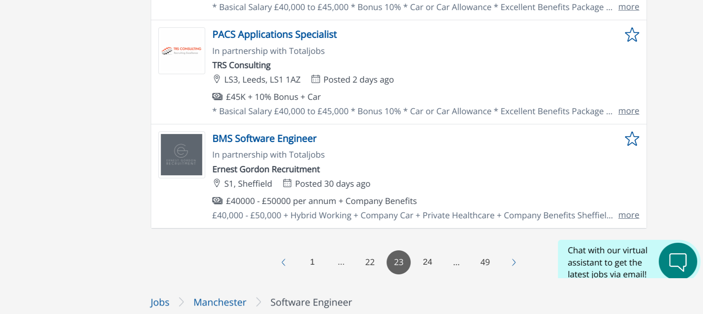

#  Jobsite web scraper - Python with selenium

## About this notebook

Automation of web job search and scraping searched job details on Jobsite with Python and Selenium on Google colaboratory

    
In this <a href="https://github.com/morikaglobal/audible_selenium/blob/master/Audible%20Selenium.ipynb" target="_blank">notebook</a>, I will automate job search and scrape the data of job results on Jobsite using Python and selenium, and store the scraped then processed data in a csv file.

the link to scrape:
https://www.jobsite.co.uk

For each listed job, following fields are scraped:
- job title
- company
- location
- salary
- job description

In my code, I will automate and scrape job search with following entries as an example, however the code also works with other search entries as well:

- job title to search - 'Software Engineer'
- location - 'Manchester'
- radius - 'within 30 miles' (select from dropdown selection)

On the website, at the time of web scraping in April 2023, the searched results looked something like this: <a href="https://github.com/morikaglobal/audible_selenium/blob/master/images/AudiblePageLong.png" target="_blank">Search results page on Jobsite</a> 

552 jobs found as the result of my search, however there is a message:

<b>"We have extended your search with 652 more results from outside the region"</b>

I only want to scrape the data of first 552 jobs but if I scrape all results I will end up with additional data of 652 jobs that I do not need, meaning I will scrape up to the very last page of 49, when all I need to scrape is up to page 23.

Therefore, I will find out how many pages I need to scrape according to the number of jobs returned by the search query made and divide the number by 25 (the number of jobs listed per page) so that I will only scrape the pages I need for speed and efficiency.

Using my scraping code, data is scraped, necessary data processing done and the data gets stored in CSV file like this: <a href="https://github.com/morikaglobal/audible_selenium/blob/master/Audible%20Top%20100%20best%20sellers.csv" target="_blank">Jobsite search result (CSV file)</a>

